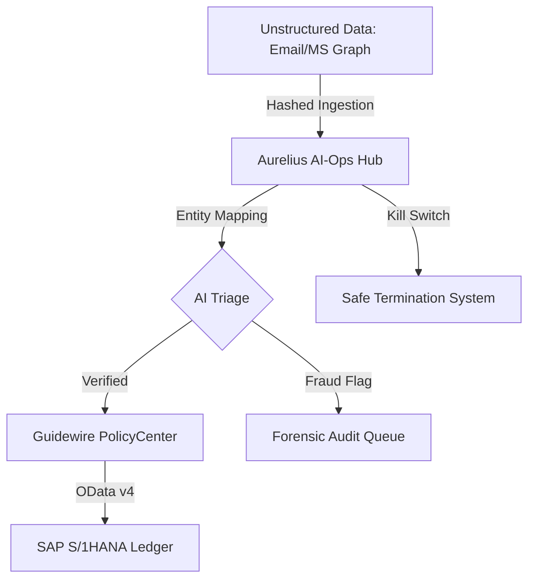

# Aurelius Hub: Enterprise AI-Ops Framework (Guidewire Cloud / SAP S/4HANA)
### Finalized Portfolio Demo: April 2026 Edition
**Developed by: Prakush Shende (AI PM | Business Analyst | GRC Specialist)**

---

## 🏛️ Executive Summary
Aurelius Hub is a high-fidelity **AI-Ops Governance Control Tower** designed to solve the "Trust Gap" in enterprise insurance workflows. It bridges the transition from unstructured legacy data (MS Graph/SFTP) to core transaction systems (**Guidewire PolicyCenter**) and financial ledgers (**SAP S/4HANA**).

This project demonstrates expertise in:
- **Product Strategy**: GRC-first AI implementation (Kill Switch architecture).
- **Technical Architecture**: OData v4, Microsoft Graph API, and Guidewire Olos integration.
- **Business Analysis**: PRD/BRD generation and 94% regression coverage simulation.

---

## 🧩 Architectural Excellence (Mermaid)

---

## 🚀 Key Modules & Value Propositions

### 1. GRC Compliance Control Tower
- **The Problem**: Lack of visibility in AI decision-making.
- **The Solution**: Real-time NAIC/EU AI Act compliance monitoring with a **Global Kill Switch** to suspend services during drift events.

### 2. Operational Data Lineage
- **Minute-Level Granularity**: Tracing data movement from source webhooks to financial reconciliation in <5 seconds.
- **SHA-256 Provenance**: Cryptographic proofs ensuring no data drift during Guidewire Entity mapping.

### 3. Documentation Vault
Full lifecycle documentation suite for Senior stakeholder review:
- **PRD**: AI Triage & Fraud Ranking.
- **BRD**: Cross-System OData Reconciliation.
- **Retirement SOP**: Legacy SFTP decommissioning strategy.

---

## 🛠️ Tech Stack & Integration Specs
- **Frontend**: React 18, Vite, Lucide Icons.
- **Styling**: Vanilla CSS (Glassmorphism / Enterprise Dark).
- **Simulated Protocols**: REST v4, OData v4, GraphQL.
- **Deployment**: Optimized for Vercel/Netlify.

---

## 📊 Business Metrics (Projected)
- **Manual Work Reduction**: 82% via automated OData entity prep.
- **Risk Mitigation**: 100% GRC compliance for EU AI Act Stage 2.
- **Operational Savings**: $2.4M/yr (based on 500-user Guidewire deployment).

---

## 📬 Contact for Strategic Review
**Prakush Shende**
*AI Product Management & Business Analysis Specialist*
[GitHub Profile](https://github.com/PrakushShende) | April 2026 Professional Portfolio

---
*Disclaimer: This is a professional portfolio demonstration. All vendor citations (SAP, Guidewire) are used for architectural simulation purposes in a recruiter-ready context.*
